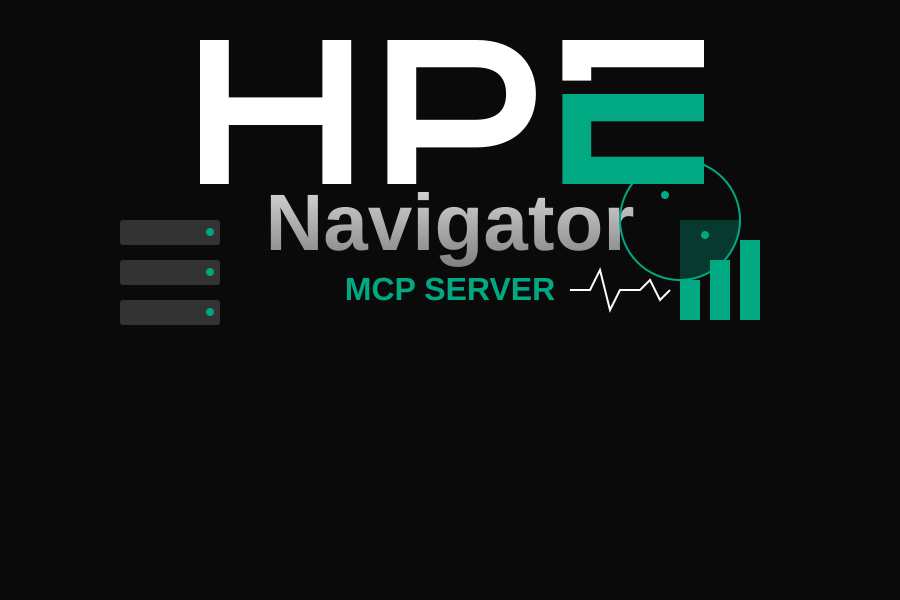

<p align="center">
  
</p>

<h1 align="center">hpe-navigator-mcp-server</h1>

<p align="center">
  
  
  
</p>

MCP server package for HPE Navigator. Exposes 12 tools for hardware serial lookup, system health monitoring, SFDC asset management, telemetry bundle retrieval, and analytics dashboard discovery.

## Installation

```bash
npm install hpe-navigator-mcp-server
```

## Usage

```bash
# As CLI
export HPE_NAV_USERNAME="you@hpe.com"
export HPE_NAV_PASSWORD="your-password"
hpe-navigator-mcp-server
```

## Tools

See the [root README](../../README.md) for full tool documentation.

## Troubleshooting

### `Error: fetch failed` / `Network error reaching web.service.cxo.suptools.hpecorp.net`

1. **VPN**: HPE Navigator endpoints are only accessible on the HPE network. Ensure your VPN is active.
2. **TLS certificates**: Node.js uses its own CA bundle (not the macOS keychain). HPE internal CAs may not be trusted.
   - Set `HPE_NAV_TLS_REJECT_UNAUTHORIZED=false` (extension setting: `hpeNavigator.tlsRejectUnauthorized`) to bypass certificate verification on trusted HPE networks.
   - The underlying error cause is now surfaced in the error message (e.g., `CERT_HAS_EXPIRED`, `UNABLE_TO_VERIFY_LEAF_SIGNATURE`).

### Service token: `Login failed` or `API error: 401`

When copying the token from the browser Network tab, DevTools shows `Bearer eyJhbGci...`.
Paste **only the raw JWT** (without the `Bearer ` prefix) into the `HPE_NAV_SERVICE_TOKEN` / `hpeNavigator.serviceToken` field — the server adds the prefix automatically. Both formats are accepted; the `Bearer ` prefix is stripped on startup if present.

### Okta login: `Okta login timed out after 2 minutes`

The server starts a local callback HTTP server (random port) and opens a browser. After you authenticate with Okta, the Navigator OIDC callback should redirect to `http://localhost:PORT/callback`.

If it still times out:

1. Check the stderr output for `Waiting for redirect to: http://localhost:PORT/callback` — that URL must be reachable from your browser.
2. On macOS, `localhost` resolves to `::1` (IPv6) by default. The callback server now listens on all interfaces (not just `127.0.0.1`), so this should be fixed.
3. If the Navigator OIDC endpoint is not configured to relay back to `localhost`, the flow cannot complete. Use service token or username/password auth instead.
